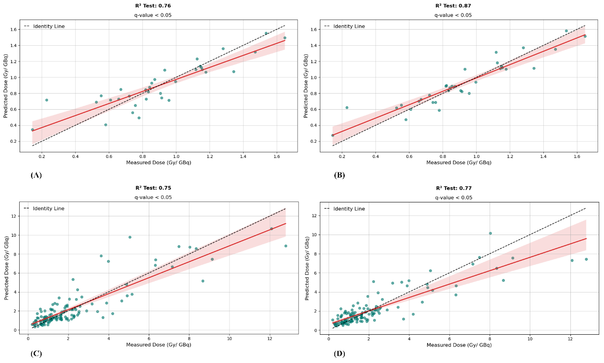
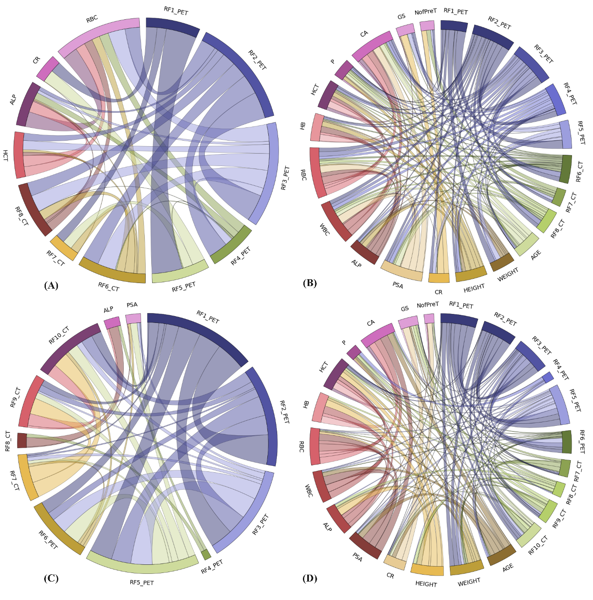

# Cancer Treatment Dose Prediction

## Overview
Cancer Treatment Dose Prediction is a machine learning-based framework designed to predict absorbed doses (ADs) in metastatic castration-resistant prostate cancer (mCRPC) patients undergoing [177Lu]Lu-PSMA-617 radioligand therapy (RLT). The model utilizes radiomic features (RFs) extracted from pre-therapy [68Ga]Ga-PSMA-11 PET/CT scans and clinical biomarkers (CBs) to estimate post-therapy absorbed doses in kidneys and tumoral lesions.

## Repository Structure
This repository contains multiple Jupyter Notebook (`.ipynb`) files, each corresponding to different experimental setups and datasets:

- `lb-cv-fs-all-final.ipynb` - Model for lymph node-based dose prediction.
- `lct-cv-fs-all-final.ipynb` - Model utilizing CT scan data for dose prediction.
- `lct1-cv-fs-all-final.ipynb` - First subset analysis using CT scan data.
- `lct2-cv-fs-all-final.ipynb` - Second subset analysis using CT scan data.
- `lpt-cv-fs-all-final.ipynb` - Model leveraging PET scan features for dose prediction.
- `lpt1-cv-fs-all-final.ipynb` - First subset analysis using PET scan data.
- `lpt2-cv-fs-all-final.ipynb` - Second subset analysis using PET scan data.

## Results and Key Plots
The model evaluates the accuracy of predicted ADs against actual measured ADs. Below are two key visualizations from the research:

### Predicted vs. Measured AD Comparison
The comparison between predicted ADs and measured ADs across different algorithms is shown below. The identity line indicates perfect agreement between predictions and measured values, reflecting higher R² values in AD estimation.

<p align="center">
  
</p>

### Chord Diagram for RF-CB Correlations
This diagram visualizes the correlations between radiomic features and clinical biomarkers at different experimental stages (E7 and E10). Line widths represent the strength of correlation, with statistically significant associations marked.

<p align="center">
  
</p>

## Citation
If you use this repository for research purposes, please cite our study:
```
@article{Jabbari2024,
  author = {Elmira Yazdani, Mahdi Sadeghi, Najme Karamzade-Ziarati, Parmida Jabari, Mahboobeh Asadi, Malihe Shahbazi Akbar, Habibeh Vosoughi, Saeed Reza Kheradpisheh, and Parham Geramifar},
  title = {Machine Learning-Based Dose Prediction in [177Lu]Lu-PSMA-617 Radioligand Therapy by Integrating Clinical Biomarkers and Radiomic Features from Pretreatment PET/CT Images},
  journal = {International Journal of Radiation Oncology, Biology, Physics},
  year = {2024},
  status = {Accepted}
}
```

## Data Availability
The dataset used in this study is **private** and cannot be shared due to patient confidentiality and institutional restrictions. For further inquiries regarding data access, please contact the corresponding authors as mentioned in the related publication.

## Dependencies
To run the models and analyses, ensure you have the following dependencies installed:
```sh
pip install numpy pandas scikit-learn matplotlib seaborn jupyter
```

## License
This project is licensed under the MIT License.
